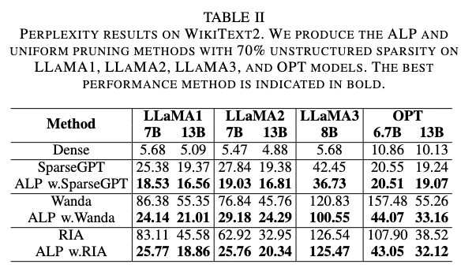
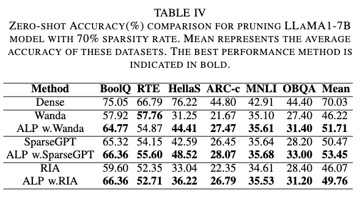

#  DLP

Official PyTorch implementation of ALP: Adaptive Layerwise Pruning in Large Language Models
      
## Table of contents

* [Abstract](#abstract)
* [Results](#Results)
* [Installation](#installation)
* [Usage](#Usage)


## Abstract

Although Large Language Models (LLMs) have demonstrated substantial capability in various downstream tasks, their extensive parameterization results in significant computational costs. The widely adopted one-shot pruning techniques are capable of effectively removing a substantial amount of redundant weights with minimal impact on model performance. However, these methods typically apply a uniform pruning rate across all layers, overlooking the varying contributions of individual layers to the model's overall performance. The efficacy of these methods diminishes notably at higher sparsity levels. The paper introduces an adaptive layerwise pruning strategy that automatically assigns different pruning rates by evaluating the sensitivity of connections to the loss function using only ten calibration samples, ensuring the effectiveness of the pruning process while maintaining the model's performance. Experimental results show that our proposed method outperforms the uniform pruning approach with high sparsity levels, with particularly notable improvements when the pruning rate exceeds 50\%. Additionally, our method can be combined with quantization techniques to enhance model compression while minimizing performance degradation.


## Results 





## Installation 
--- 
Installation instructions can be found in [INSTALL.md](INSTALL.md).


## Usage

### Calculating Connection Sensitivity

```
python save_gradient.py
```


### Script example of pruning llama-7b

```
    python   main.py \
    --model "Enoch/llama-7b-hf" \
    --grad_nsamples 10 \
    --alpha 0.15 \
    --prune_method "wanda_alp" \
    --sparsity_ratio 0.7 \
    --sparsity_type "unstructured" \
    --save_log
```

### Zero-shot Evaluation
```
    python   main.py \
    --model "Enoch/llama-7b-hf" \
    --grad_nsamples 10 \
    --alpha 0.15 \
    --prune_method "wanda_alp" \
    --sparsity_ratio 0.7 \
    --sparsity_type "unstructured" \
    --eval_zero_shot \
    --save_model "pruned/wanda_alp/llama-7b-hf_sparsity0.7" 
    --save_log
```

### Acknowledgement
The repository is build upon the [RIA](https://github.com/biomedical-cybernetics/Relative-importance-and-activation-pruning), [Wanda](https://github.com/locuslab/wanda) and [SparseGPT](https://github.com/IST-DASLab/sparsegpt) repositories.


